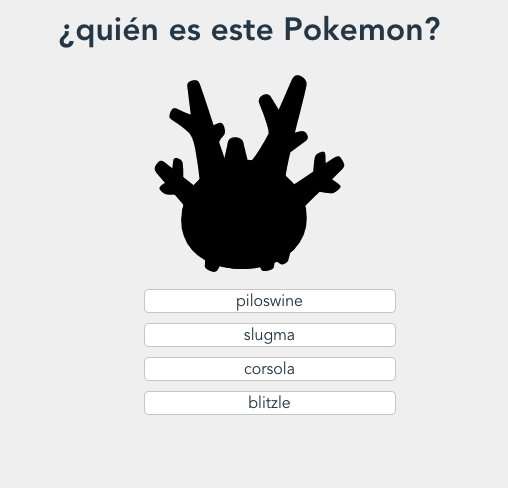
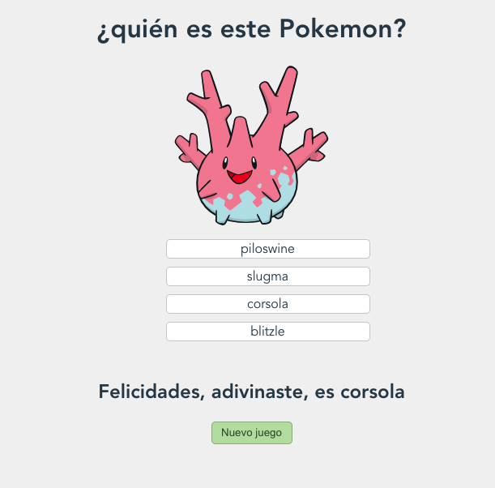

# This is a VueJs practice. A Pokemos game was built for practicing the interaction between components

## Screenshots:


## Project setup
- Make sure you have yans installed running `yarn -v`. If not, run:
```
yarn install
```
- Clone the repo using the command:
```
git clone git@github.com:MiguelArgentina/pokemon-game-vue-practice.git
```


- For compiles and hot-reloads for development
```
yarn serve
```

- For compiles and minifies for production
```
yarn build
```

- For running your unit tests
```
yarn test:unit
```

### Acknowledgments:
- Fernando Herrera (Udemy):
  - [Twiter: @Fernando_Her85](@Fernando_Her85)
  - [Personal webpage (recommended!!)](https://fernando-herrera.com/#/)